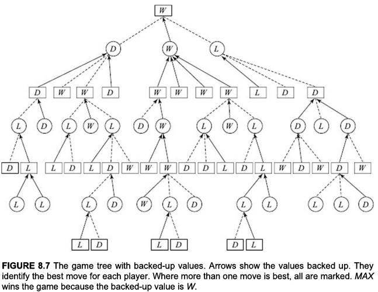

## game
a game can be defined as a type of search problem with the following elements:
1. s0
    - start state of the game
2. PLAYER(s)
    - defines which player has a move in state
3. ACTIONS(s)
    - returns the set of legal moves in a state
4. RESULT(s, a)
    - the transitional model which the result of the move
5. GOAL-TEST(s)
    - returns true when S is the goal state
6. UTILITY(s, p)
    - also called as objective function or payoff function
    - 
s -> terminal state p -> player

    - utility function defines the final numeric value for a game that ends in terminal state `s` for a player `p`
    - for example, in chess the final outcome is win, loss or draw with numeric value +2 for win, +1 for draw and 0 for loss

## game tree
- we assume that the game is a zero sum game (n 0 sum games, the total payoff is zero. One player's gain is other player's loss)
- our two players are names MIN and MAX, indicationg that thir goals are opposite of each other.
- a game is represented by a game tree. It is a tree in which at each alternating level, one or the other player makes the choices.
- Given a game tree, it is possible to analyse the game and determine the outcome when both players play perfectly. We can do this by backing up values from the leaf nodes up to the root. The backup rule is as follows.
- Minimax rule

    - If the node is a MAX node, back up the maximum of the values of its children.
        > value(node) = max {value(c) | c is a child of node}
    - If the node is a MIN node, back up the minimum of the values of its children.
        > value(node) = min {value(c) | c is a child of node}
    - The minimax value of the game is the backed-up value of the root from all the leaves, and represents the outcome when both the players play perfectly.

- Figure 8.7 shows the above game tree with backed-up values. Observe that MAХ wins this game when both players play their best.

## optimal decisions in games
