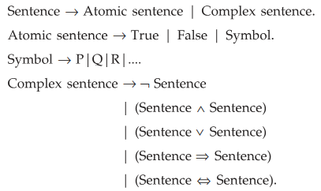
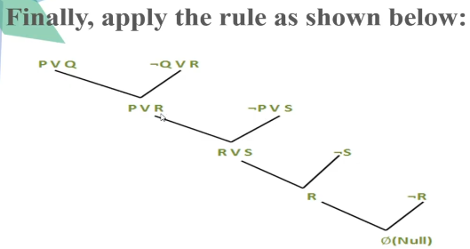

# Knoledge representation issues
## representation and mapping
### Introduction
- Search-based problem solving programs require knowledge.
- Knowledge can be a set of states or path toward solution, rules, etc.
- need to represent this knowledge in a particular format.
> Knowledge Representation is an important issue in computer science in general and in AI in particular.
- intelligent systems should be knowledge based, knowledge is represented in the **system's knowledge base**, which consists of <ins>*data structures and programs*</ins>. Intelligent system are also expected to have a program called an **inference engine** that implements the <ins>*reasoning patterns*</ins> necessary for the task at hand. 

### Issues in Knowledge Representation
**Basic Attributes**
- Some attributes are so common they appear in almost every problem.
- Two key ones are:
    - ISA (e.g., "A dog is a mammal") – defines categories.
    - Instance (e.g., "Fido is an instance of dog") – defines specific examples.
- These help with property inheritance (e.g., if all mammals have lungs, and a dog is a mammal, then dogs inherit lungs).

**Relationships Between Attributes**
- This refers to **how attributes relate to each other**, including (e.g., inverses like "parent/child").
- Example: `band(John Zorn, Naked City)`  
This could be interpreted inversely as:  
    ```
    memberOf(John Zorn, Naked City) or
    hasMember(Naked City, John Zorn)
    ```
**Granularity (Level of Detail)**
- How fine-grained should knowledge be?
- Example: consider, `feeds(Tom, dog)` and `gives(Tom, dog, bone)`\
Are these the same? Maybe, if "giving food" implies "feeding," but rules are needed to link them.
Too many primitives (basic concepts) can lead to storage/complexity issues.  
Reasoning: How to infer values (e.g., if X gives food, does X feed?)
- Representing knowledge requires balancing clarity, detail, and rules to connect concepts. Too few primitives oversimplify; too many become unwieldy. The right level depends on the problem.

### the techniques of representation and mapping
- *Forward representation* which maps from factss to representation
- *Backward representation* which maps the other way

## approaches to knowledge representation
- a good system for representation of knowledge in a particular domain should possess the following properties -
    1. representational adequacy - ability to represent all kinds of knowledge for/in that domain
    2. inferential adequacy - ability to manipulate representational structures in a way so as to derive new structures corresponding to new knowledge inferred form old.
    3. inferential efficiency - ability to incorporate additional information into the knowledge structure.

<hr>
<hr>

# Logic in general
- Logics are formal languages for representing information such that conclusions can be drawn
- Syntax defines the sentences in the language
- Semantics define the "meaning" of sentences, i.e., define truth of a sentence in a world
- E.g., the language of arithmetic
    - x+2 ≥ y is a sentence; x2+y > {} is not a sentence
    - x+2 ≥ y is true iff the number x+2 is no less than the number y
    - x+2 ≥ y is true in a world where x = 7, y = 1
    - x+2 ≥ y is false in a world where x = 0, y = 6

# Logical Agents and Knowledge Representation using Propositional Logic
- propositions: statements that can be either true/false.  for example:  
`2+2=4`  
`2+2=5`  
`the sun is a moon`
- *questions are not propositions*. For ex: `What is the time?`
- we can modify propositions using connectives: ^(and/conjunction), v(or/disjunction), ~(not/negation), →(implies/implication), ≡(iff/biconditional)
- propositional logic: a branch of logic that studies the how propositions are combined and altered to form more complex statements.
## Characteristics of Propositional Logic
1. declarative(pieces of syntax correspond to facts)
2. compositional
3. allows partial/disjuncted/negated inference
4. meaning in pl is context independent(unlike in nlp) 
## Drawbacks of Propositional Logic
1. not expressive enough. there are some valid arguments in english that cannot be represented in PL. (can't express "pits causes breezes in adjacent squares". one needs to write one sentence for each square)
2. Propositional logic can represent facts about the world, but it doesn’t show what’s inside those facts or how things in the world are related to each other  
eg `p: "It is raining"` & `q: "I will take an umbrella"`  
pl does not break down the internal structure of statements or model the actual entities (like “rain”, “umbrella”, or “I”) or their relationships.
3. two cases are hard to represent:
    1. statements about **multiple objects having the similar relationships**.
        - In PL, you’d write something like:  
            `P: "Alice likes Bob"`, `Q: "Charlie likes David"` and `R: "Eve likes Frank"`
        - But notice:\
            PL doesn't recognize any pattern — like `“X likes Y”` or it can’t generalize: `"Everyone likes someone"` or `"If X likes Y, then Y likes X"`
    2. statements **referring to group objects**
        - In PL, you'd need a separate symbol for each possible statement:                
            `P: "Student A passed"`, `Q: "Student B passed"` and `R: "Student C passed"`\
            Then you'd try something like `P ∧ Q ∧ R` to say they all passed
        - But this is:\
            Not scalable (what if there are 1,000 students?)\
            Not general — no way to say “all students” in a clean way
## Syntax for Propositional Logic
- syntax defines the rules to form valid expressions(formulas)
- symbols:
    1. Propositional symbol: Propositions are denoted with capital letters like A, B, C, P, Q, etc.
    2. Constant symbols: represent objects or entities in a domain. Eg, Dipu and book in 'Dipu reads book'
    3. truth symbols: true, false
    4. connectives: →(implies), ↔(iff), ¬(negation), ∧(conjunction), ∨(disjunction)
    4. other symbols: (, )
- Every propositional symbol and truth symbol is a sentence. For eg, true, P, Q, R are sentences
- a formula is a well formed formula(wff), iff it is built from the elements above according to specific rules
    1. Any propositions is a wff (eg, P, Q, R, A, X, Y,...)
    2. if A is a wff, then ¬A is also wff
    3. if A and B are wffs then, (A ∧ B), (A ∨ B), (A → B) and (A ↔ B) are also wff
    4. nothing else is wff
    5. the symbols () and [] are used to group the symbols into subexpressions by which their order of evaluation and meaning are controlled. For eg, (A ∨ B) ↔ C is not same as A ∨ (B ↔ C)
### Formal grammar for Propositional Logic
- the BNF (backus naur form) grammar of sentences in pl is as described below:  

- the order of precedence for the connectives from highest to lowest is: ¬, ∧, ∨, →, ↔
### Inference in the Knowledge Base
- yeh nahi samja

## Semantics for Propositional Logic
- the semantics of PL involve two important functions:
    1. the interpretation function: takes propositional letters as input and assigns truth values to these propositional letters.
    2. the valuation function: assigns a truth value (T or F) to a wff depending upon the truth values of propositional letters and the operators that compose that wff.
### Interpretation of propositions
1. An interpretation of a pl is a function that takes propositional letters as input and assigns a them truth value (T or F) as output
2. The symbol true is always assigned T and the symbol false is assigned F.  
  

### Computation of Truth Values
- valuation function  

### Truth Table
- kuch nahi hai ye. technical me se dekh sakte
- a second and equivalent method for presenting the meaning of the symbols and wffs in PL makes use of 'truth tables'. A truth table is simply a graphical display of the interpretation and valuation functions. 
    - idhar har ek conjunctive ke liye tt banao aur usko semantics kah ke examiner ko chipka do.
### Validity
- a sentence is valid if it is true in all models
- for eg, (Parrot is green ∨ Parrot is not green)
- valid sentence is called **tautology**
### Satisfiability
- a sentence is satisfiable if it is true in some model
- if a sentence S is true in model m, the we say that m satisfies S or m is a model of S
### A complete exaple of Knowledge-based Agent (in Wumpus world)
- A wumpus world agent
- PEAS description
- Wumpus world characterization
- exploring the wumpus world
## Reasoning Patterns in Propositional Logic
- there are statndard patterns that can be applied to derive chains of conclusions that lead to desired goal. These pattern of inference are called inference rules.
### the concept of monotonicity
- ye nahi krra mai
### Inference Rules
> List the <mark>inference rules used in prepositional logic</mark>? Explain them in detail with suitable <mark>example</mark>.
- with inference rules, we can derive new statements(conclusions) from existing ones(premises)
- common inference rules in PL:
    1. Modus Ponens:
        If P → Q and P are both true, then Q is true.  
        Example:  
            P → Q: If it rains, the ground gets wet  
            P: It rains  
            ➡️ Q: The ground gets wet
    2. Modus Tollens:
        If P → Q and ¬Q, then ¬P
        Example:  
            P → Q: If it’s a bird, it can fly  
            ¬Q: It can’t fly  
            ➡️ ¬P: It’s not a bird
    3. Hypothetical Syllogism:
        If P → Q and Q → R, then P → R
        Example:  
            If I study, I will pass  
            If I pass, I will graduate  
            ➡️ If I study, I will graduate
    4. Disjunctive Syllogism:
        If P ∨ Q and ¬P, then Q  
        Example:  
            Either it’s a weekday or a weekend  
            It’s not a weekday  
            ➡️ It’s a weekend
    5. Conjunction:
        If P and Q are true, then P ∧ Q is true  
        Example:  
            P: It’s cold  
            Q: It’s raining  
            ➡️ It’s cold and raining
    6. Simplification:
        From P ∧ Q, you can infer P (or Q)  
        Example:  
            It’s Monday and sunny  
            ➡️ It’s Monday
    7. Addition:
        If P is true, then P ∨ Q is also true (no matter what Q is)  
        Example:  
            P: I am tired  
            ➡️ I am tired or I am a superhero 😄
    8. Resolution: If one of two atomic propositions in an or proposition is false, the other has to be true    
        Example:  
        P ∨ Q: Ron is in the great hall or Hermione is in the library
        ¬P: Ron is in the great hall
        From P ∨ Q and ¬P, we infer Q: Hermione is in the library

        extra - From P ∨ Q and ¬P ∨ R, infer Q ∨ R  
        Example:  
            P or Q is true  
            Not P or R is true  
            ➡️ Therefore, Q or R is true
    > What is Resolution? Solve the following statement by using resolution algorithm. Draw suitable resolution graph.  
        1. Rajesh like all kind of food.  
        2. Apple and vegetables are food.  
        3. Anything anyone eats and is not killed is food.  
        4. Ajay eats peanuts and still alive.    
        Prove that Rajesh like bananas.  

    > 1. resolution method is an inference rule which is used in both predicate and propositional logic in different ways
    > 2. this method is basically used to prove the satisfiability of a sentence
    > 3. in resolution method, we use proof by refutation technique to proove the given statement
    > 4. the key idea for resolution method is to use the knowledge base and negated goal to obtain the null clause(which indicates contradiction)
    > 5. resolution method is also called proof by refutation. since the kb itself is consistent, the contradiction must be introduced by a negated goal
    > 6. as a result, we have to conclude that the original is true
    > 7. kisi fact ko agar proove krna hai to following steps karo-  
        1. Convert the given axiom into clausal form, i.e., disjunction form.  
        2. Apply and proof the given goal using negation rule.  
        3. Use those literals which are needed to prove.  
        4. Solve the clauses together and achieve the goal.
    > 8. 
    > 9. Example of propositional resolution  
      
        `P: humidity is high`; `Q: sky is cloudy`; `R: it will rain`; `S: it is hot`  
        Therefore, 1:(P ∨ Q), 2:(Q → R), 3:(P → S), 4:(¬S)  
      
    
    > 10. After applying Proof by Refutation (Contradiction) on the goal, the problem is solved, and it has terminated with a Null clause (Ø). Hence, the goal is achieved. Thus, It is not raining.

## Forward and Bckward chaining
### the Horn Clause
### Forward chaining method
### Backward chaining algorithm
## 7.7 Effective Propositinal Inference - DROP
## 7.8 Local Search Algorithms for Inferencing in Propositional Logic - DROP
## Knowledge based agent
### Inference based agent in Wumpus world - Agent based on propositional Logic
### Circuit based agent in Wumpus world
### Comparison between Inference based agent (IBA) and Circuit based agent (CBA)


<hr>
<hr>

<hr>
<hr>
<hr>
<hr>

```
The language of predicate logic is a formal (logical) language. As a formal language it consists of two parts:
1. a set of symbols (its alphabet)
2. a syntax (its grammar expressed in terms of a set of formation rules)
Once this language is constructed, this formal language gets interpreted by a logical semantics.
3. a semantics (rules for assigning truth values (e.g. T or F to well-formed formulas))
```
> Explain <mark>syntax and semantics of FOL</mark> in detail.
- FOL symbols:
    1. names: lowercase letters, a through v with or without numerical subscripts
    2. n-place predicates: uppercase letters, A through Z with or without numerical subscripts
    3. variables: lowercase letters, w through z with or without numerical subscripts
    4. operators: →(implies), ↔(iff), ¬(negation), ∧(conjunction), ∨(disjunction)
    5. parentheses: (, )
    6. quantifiers: ∀("for all"), ∃("there exists")
- Syntax(the proper way to combine these symbols): Well-formed formulas (wff) of FO logic are composed of six types of symbols (not counting parentheses).
    1. constants symbols, e.g. nouns like Bob.
    2. function symbols: represent functions that map elements of the domain of discourse to other elements within the same domain. For example, fatherOf is a single-parameter function symbol. Zero-argument function symbols are thought of as the same as constants.
    3. predicate symbols: a symbol, usually an uppercase letter like P, Q, or R, that represents a property. For example, let Owns be a two-arity predicate, then
    Owns(Bob, Car) may be indended to indicate that Bob owns Car.
    4. variables: used to quantify over objects. for eg. x, y
    5. universal and existential quantifiers: used to indicate the type of quantification
    6. logical connectives and negation (⇒, ∧, ∨, ⇐⇒ , and ¬), which are the usual way of composing wffs from other wffs.
- semantics: wo fol ki 8 pgs ki pdf se dekh le bhai
- examples
    1. example: "jeffery is happy"
        - Hx: x is a happy
        - j: Jeffery
        - solution: Hj
    1. example: "Solomon and Kevin are both dogs"
        - Dx: x is a dog
        - s: Solomon
        - k: Kevin
        - solution: Ds and Dk
    1. "Carlos is happier than Sue, but sadder than Fred"
        - Hxy: x is happier than y
        - Sxy: x is sadder than y
        - c: Carlos
        - s: sue
        - f: Fred
        - solution: Hcs and Scf
    1. "James is a trouble maker when Kevin dislikes him"
        - Tx: x is a trouble maker
        - Dxy: x dislikes y
        - j: james
        - k: Kevin
        - solution: Dkj -> Tj
    1. "every dog is happy"
        - Dx: x is a dog
        - Hx: x is happy
        - solution: (∀x)(Dx -> Hx)
    1. "some dog is happy"
        - Dx: x is a dog
        - Hx: x is happy
        - solution: (∃x)(Dx ∧ Hx)
    1. "a kid is angry"
        - Kx: x is a kid
        - Ax: x is angry
        - solution: (∃x)(Kx ∧ Ax)
    1. "every monster is scary"
        - Mx: x is a monster
        - Sx: x is scary
        - solution: (∀x)(Mx -> Sx)
    1. "some friend is loving and caring"
        - Fx: x is friend
        - Lx: x is loving
        - Cx: x is caring
        - solution: (∃x)(Fx ∧ (Lx ∧ Cx))
    1. "all mammals love fred"
        - Mx: x is a mammal
        - Lxy: x loves y
        - f: Fred
        - solution: (∀x)(Mx -> Lxf)
    1. "every friend who eats sushi is tall"
        - Sx: x is sushi
        - Exy: x eats y
        - Tx: x is tall
        - Fx: x is friend
        - solution: ∀x( (Fx ∧ (∀y)(Sy -> Exy)) -> Tx)
    1. "some kid made fun of Fred and ate some teacher"
        - Kx: x is a kid
        - Axy: x ate y
        - Tx: x is a teacher
        - Fxy: x made fun of y
        - f: Fred
        - solution: ∃x( Kx ∧ Fxf ∧ ∃y(Ty ∧ Axy) )∀
    1. "all dogs chase all kittens"
        - Dx: x is a dog
        - Kx: x is a kitten
        - Cxy: x chases y
        - solution: ∀x∀y( (Dx ∧ Ky) -> Cxy)
    1. "every sheep likes mary"
        - Sx: x is a sheep
        - Lxy: x likes y
        - m: mary
        - solution: (∀x)(Mx -> Lxm)


<hr>
<hr>

> Differentiate between propositional logic and First order logic.
> Compare propositional and predicate Logic.

|propositional|Predicate|
|----|----|
|It deals with simple declarative propositions| For additionally covers predicates & quantification|
|It is collection of dec-laxative sentences that has esther "True" or "False" truth values.| It is expression of one or more variables defined. on some specific domain|
| It is most basic and widely used logic| It is an extension to propositional logic|
| It includes certainty as well as uncertainty| It includes objects, functions & relations beth objects.|
| It is useful for reasoning| It is different from PL which lacks quantifiers.|
|It is not complex|It is complex due to inclusion of quantifiers & predicates|
|Inference rules are based on truth table & logical connectives.|Inference rules are rules for quantifiers & predicates|

<hr>
<hr>
<br>

> What is an Agent. Name any 5 agents around you. Explain Knowledge based agent with Wumpus World.
> What is an Agent? Name any 5 agents around you explain knowledge based agent with Wumpus World.  
> Explain Wumpus world environment giving its PEAS description.
- youtube varun bagh

> Write an propositional logic for the statement,
    - "All birds fly"  
    - "Every man respect his parents"

> Consider the following axioms:
    - If a triangle is isosceles, then its two sides AB and AC are equal,
    - If AB and AC are equal, then angle B and C are equal
    - ABC is an equilateral triangle,
    Represent these facts in predicate logic. Explain Inference in Propositional Logic.

> List and explain in short the various steps of knowledge engineering process
- Knowledge engineering is the process of building a knowledge base that can be used by intelligent systems.
- It involves several steps to ensure that the system understands and uses knowledge correctly.
- page 8-21 to 8-25
- Decide what the system should do.
1. identify the task
    - Should it answer questions, make decisions, or both?
    - Also, identify what information will be available.
    - This helps decide what knowledge the system needs.
    - For example, does the wumpus knowledge base need to be able to choose actions or is it required to answer questions only about the contents of the environment?
    - Will the sensor facts include the current location?
    - The task will determine what knowledge must be represented in order to connect problem instances to answers.
2. Assemble the relevant knowledge.
    - The knowledge engineer might already be an expert in the domain, or might need to work with real experts to extract what they know a process called knowledge acquisition.
    - At this stage, the knowledge is not represented formally.
    - The idea is to understand the scope of the knowledge base, as determined by the task, and to understand how the domain actually works.
    - For the wumpus world, which is defined by an artificial set of rules, the relevant knowledge is easy to identify.
    - Gather knowledge about the task. This could be from books, experts, or personal understanding. At this stage, don't worry about format-just focus on what is important for solving the task.
    - Example: In the Wumpus world, learn the rules-like how smells indicate nearby danger.
3. Decide on a vocabulary of predicates, functions, and constants.
    - Translate the important domain-level concepts into logic-level names.
    - This involves many questions of knowledge-engineering style.
    - For example, should pits be represented by objects or by a unary predicate on squares?
    - Should the agent's orientation be a function or a predicate? Should the wumpus's location depend on time? Once the choices have been made, the result is a vocabulary that is known as the ontology of the domain.
    - Choose how to describe things logically. Define terms (like objects, locations, and properties) using logical names. This step creates the ontology-a structured set of terms that defines what exists in the system.
    - Example: Define Pit(x) to mean "there is a pit at x" or Adjacent(x, y) to show location relationships
4. Encode general knowledge about the domain.
    - The knowledge engineer writes down the axioms for all the vocabulary terms.
    - This pins down the meaning of the terms, enabling the expert to check the content. Often, this step reveals misconceptions or gaps in the vocabulary that must be fixed by returning to step 3 and iterating through the process.
    - Write rules (axioms) that describe how the world works using the vocabulary you defined. These rules should be general and apply to any situation in the domain.
    - Example: "If a place is smelly, then there is a Wumpus nearby."
5. Encode a description of the specific problem instance
    - Add specific facts to the knowledge base. These are like the inputs for one situation or case. If your earlier vocabulary and rules are good, this step is easy.
    - Example: Say "Location (2,3) is smelly" to describe a specific situation in the Wumpus world.
6. Pose queries to the inference procedure and get answers
    - Ask questions to the system and let it use the rules and facts to find answers. This is where the system "thinks" using logic.
    - Example: Ask "Is it safe to go to (3,3)?" and get a yes or no based on what the system knows.
7. Debug the knowledge base
    - If the system gives wrong or unexpected answers, go back and fix errors. Maybe a rule is missing, too weak, or just incorrect. Repeat steps as needed.
    - Example: If the system cannot tell whether a square is safe, maybe the rule about smell and danger isn't strong enough or is written wrongly.